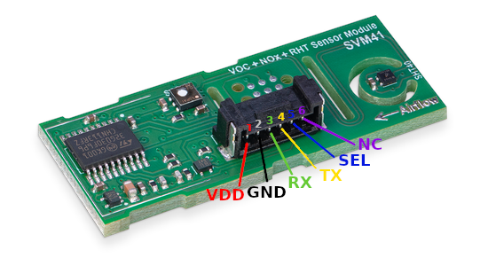

# Sensirion UART SVM4X embedded Library

This document explains how to set up a SVM4X evaluation kit to run on an embedded device over UART using the SHDLC protocol.


Click [here](https://www.sensirion.com/my-sgp-ek/) to learn more about the Sensirion SVM4X evaluation kit. The SVM4x evaluation kit covers evaluation of the SGP40 and SGP41 sensors.


## Setup Guide

### Connecting the Sensor

Your sensor has 5 different signals that need to be connected to your board: VDD, GND, RX, TX, SEL.
Use the following pins to connect your SVM4X:



| *Pin* | *Cable Color* | *Name* | *Description*  | *Comments* |
|-------|---------------|:------:|----------------|------------|
| 1 | red | VDD | Supply Voltage | 3.3 or 5V
| 2 | black | GND | Ground | 
| 3 | green | RX | UART: Transmission pin for communication | 
| 4 | yellow | TX | UART: Receiving pin for communication | 
| 5 | blue | SEL | Interface select | Leave floating or pull to VDD to select UART
| 6 | purple | NC | Do not connect | 


### Configure the code

In order to use the provided code we need to adjust three files according to your platform.

### Edit `sensirion_uart_hal.c`

This file has to contain the implementation of the sensor communication, which
depends on your hardware platform. We provide function stubs for your
hardware's own implementation.
A sample implementation is available for Linux based platforms
like Raspberry Pi. You can just replace the unimplemented HAL template with the
implementation in `sample-implementations/linux_user_space/`:

```
cp sample-implementations/linux_user_space/sensirion_uart_hal.c ./
```

### Edit `sensirion_uart_portdescriptor.h`

The file `sensirion_uart_portdescriptor.h` contains the type definition of the port descriptor `UartDescr` and a 
definition for the default descriptor `SERIAL_0`.  `SERIAL_0` is the value that is used in the usage example to select
the appropriate UART port.

For the linux user space implementation the type of the port descriptor is `const char *` and the default descriptor 
defaults to `"/dev/ttyUSB0"`.

Define these two values to match with your implementation. 


### Edit `sensirion_config.h`

Skip this part for Linux based platforms since everything is already setup for
this case.

Otherwise you need to check if the libraries `<stdint.h>` and `<stdlib.h>` are
provided by your toolchain, compiler or system. If you have no idea on how to
do that you can skip this step for now and come back when you get errors
related to these names when compiling the driver.
The features we use from those libraries are type definitions for integer sizes
from `<stdint.h>` and `NULL` from `<stdlib.h>`. If they are not available you
need to specify the following integer types yourself:

* `int64_t` = signed 64bit integer
* `uint64_t` = unsigned 64bit integer
* `int32_t` = signed 32bit integer
* `uint32_t` = unsigned 32bit integer
* `int16_t` = signed 16bit integer
* `uint16_t` = unsigned 16bit integer
* `int8_t` = signed 8bit integer
* `uint8_t` = unsigned 8bit integer

In addition to that you will need to specify `NULL`. For both we have a
detailed template where you just need to fill in your system specific values.

Now we are ready to compile and run the example usage for your sensor.

## Compile and Run

Pass the source `.c` and header `.h` files in this folder into your C compiler
and run the resulting binary. This step may vary, depending on your platform.
Here we demonstrate the procedure for Linux based platforms:

1. Open up a terminal.
2. Navigate to the directory where this README is located.
3. Navigate to the subdirectory example-usage.
4. Run `make` (this compiles the example code into one executable binary).
5. Run the compiled executable with `./svm4x_uart_example_usage`
6. Now you should see the first measurement values appear in your terminal. As
   a next step you can adjust the example usage file or write your own main
   function to use the sensor.

## Compile and Run Tests

The testframekwork used is CppUTest. Pass the source `.cpp`, `.c`  and header `.h`
files from the tests and top level folder into your CPP compiler and run the
resulting binary. This step may vary, depending on your platform.
Here we demonstrate the procedure for Linux based platforms:

1. Open up a terminal.
2. Install CppUTest framework `apt install cpputest`.
3. Navigate to the directory `tests`.
4. Run `make` (this compiles the test code into one executable binary).
5. Run the compiled executable with `./svm4x_uart_test`.
6. Now you should see the test output on your console.

# Background

## Files

### sensirion\_shdlc.[ch]

In these files you can find the implementation of the SHDLC protocol used by
Sensirion sensors. The functions in these files are used by the embedded driver
to build the correct frame out of data to be sent to the sensor or receive a
frame of data from the sensor and convert it back to data readable by your
machine. The functions in here calculate and checksum, reorder bytes for
different byte orders and build the correct formatted frame for your sensor.

### sensirion\_uart\_hal.[ch]

These files contain the implementation of the hardware abstraction layer used
by Sensirion's UART embedded drivers. This part of the code is specific to the
underlying hardware platform. This is an unimplemented template for the user to
implement. In the `sample-implementations/` folder we provide implementations
for the most common platforms.

### sensirion\_config.h

In this file we keep all the included libraries for our drivers and global
defines. Next to `sensirion_uart_hal.c` *it's the only file you should need to
edit to get your driver working.*

### sensirion\_common.[ch]

In these files you can find some helper functions used by Sensirion's embedded
drivers. It mostly contains byte order conversions for different variable
types. These functions are also used by the I2C embedded drivers therefore
they are kept in their own file.

## Contributing

**Contributions are welcome!**

We develop and test this driver using our company internal tools (version
control, continuous integration, code review etc.) and automatically
synchronize the master branch with GitHub. But this doesn't mean that we don't
respond to issues or don't accept pull requests on GitHub. In fact, you're very
welcome to open issues or create pull requests :)

This Sensirion library uses
[`clang-format`](https://releases.llvm.org/download.html) to standardize the
formatting of all our `.c` and `.h` files. Make sure your contributions are
formatted accordingly:

The `-i` flag will apply the format changes to the files listed.

```bash
clang-format -i *.c *.h
```

Note that differences from this formatting will result in a failed build until
they are fixed.


# License

See [LICENSE](LICENSE).